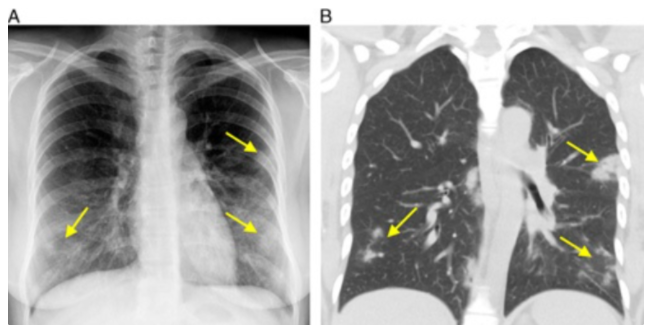
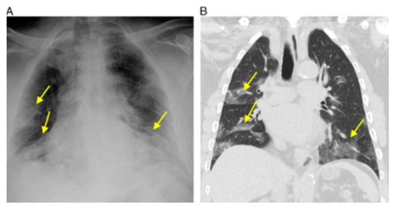
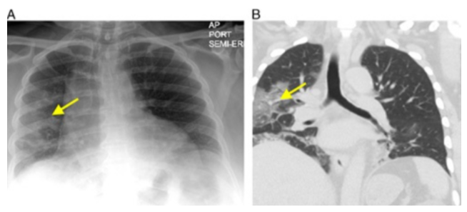
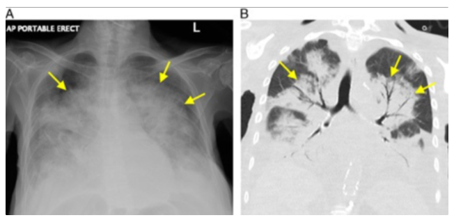
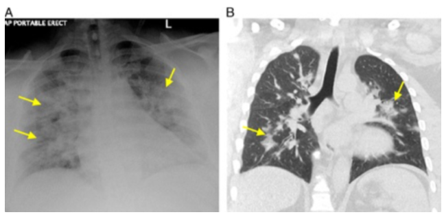
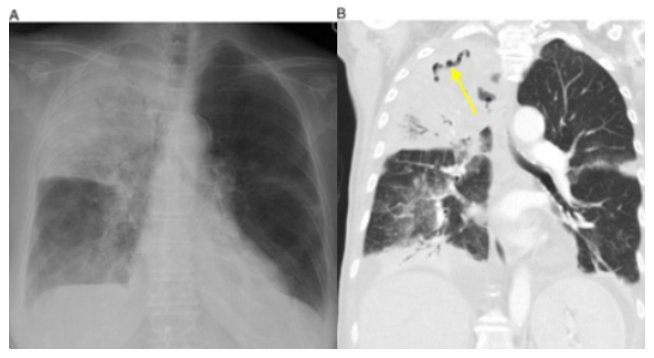
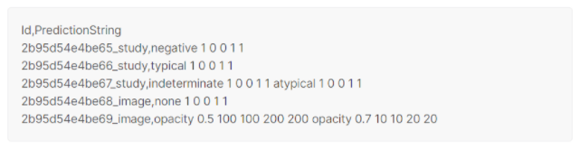
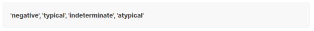
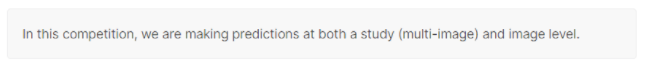
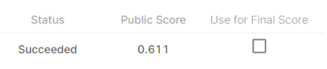

# Dataset Analysis for Kaggle Competition

> Open Source Software 수업의 assignment를 위해 새로 작성된 글이며, 2021/07에 참여한 Kaggle Competition의 데이터 분석 과정을 Markdown으로 작성(연습용)한 글입니다.

----

#### 1. Data 재분석해보기

 :crystal_ball: 의학용어 GGO(Ground-Glass Opacity) : 간유리음영 간유리음영은 폐 CT촬영에서 비특이적으로 음영이 증가된 소견 다양한 질환(감염, 만성, 급성 폐질환, 코로나19 등)에 나타날 수 있는 형태

​	⇒ CXR(흉부 방사선)에서 Opacity가 발견된다는 게 어떠한 폐 질환일 수 있다

[Blog link explaining about GGO](https://eternitymed.tistory.com/entry/%EC%9D%98%ED%95%99%EC%9A%A9%EC%96%B4-GGO-%EB%AC%B4%EC%8A%A8%EB%9C%BB%EC%9D%B8%EC%A7%80-%EC%95%8C%EC%95%84%EB%B3%B4%EC%9E%90)

 

이미지는 4 class 중 하나로 분류됨 (네 개는 각각 독립적)

 	의학 영어단어(용어)의 단순 해석으로 어색할 수 있다...

* **Typical Appearance** : 둥근 형태학, 낮은 폐-주위 분포의 다초점 쌍방향, 말초부 불투명도
  * COVID-19 폐렴의 대표적인 발견이 존재하지만, 다른 종류의 감염이나 약물 반응, 급성 폐손상의 원인과 중복될 수 있다는 소견
* **Indeterminate Appearance** : 일반적인 소견의 부재 및 일방적, 중추적 또는 상부 폐의 지배적 분포
  *  다양한 감염 및 비감염 조건에서 발생할 수 있는 COVID-19 폐렴에 대한 미확정적 소견
* **Atypical Appearance** : 기흉, 흉막삼출, 폐부종, 쇄골 통합, 단독 폐결절 또는 질량, 확산 작은 결절, 충치
  * COVID-19 폐렴에 대해서 이상하거나 드물게 보고된 발견(COVID-19에서는 거의 나타나지 않는 발견이라는 뜻). COVID-19이 아닌 다른 대체 진단 고려(다른 폐질환)
* **Negative for Pneumonia** : 폐렴 X
  * 폐렴의 소견은 없음. 하지만 COVID-19 폐렴 발생 초기 단계에서는 CXR 결과로는 진단이 누락될 수 있다(발견 못할 수 있다.)

 

[Document link for describing about dataset](https://journals.lww.com/thoracicimaging/Fulltext/2020/11000/Review_of_Chest_Radiograph_Findings_of_COVID_19.4.aspx)

위 링크의 Document의 짧은 리뷰를 통한 데이터 해석

 

CXR(흉부방사선)에서 COVID-19 폐렴의 **일반적인(typical) 또는 미확정적인(Indeterminate)**, 특성이 발견되면 바이러스 감염 가능성이 있다고 판단. 아래는 COVID-19의 가능성이 있는 findings의 classification

1. **Typical** : COVID-19의 문헌에서 흔하게 나타나는 전형적인 특성을 가진 CXR.

   

   > COVID-19폐렴 환자의 CXR. 다초점의 원형 불투명 부분(multifocal rounded opacities)을 볼 수 있음, 오른쪽은 상응하는 GGO 이미지

   

   > COVID-19폐렴 환자의 CXR. 다초점의 흐릿한 불투명 부분(multifocal hazy opacities)을 볼 수 있음, 오른쪽은 상응하는 GGO 이미지

    

2. **Indeterminate** : COVID-19 폐렴에 보고된 적이 있는 미확정적인 특성을 가진 CXR이지만 다른 병리학적 증상들과도 상당히 겹친다.

   

   > COVID-19폐렴 환자의 CXR. 흐릿한 불투명 부분(mild hazy opacity)를 보임

   

   > COVID-19폐렴 환자의 CXR. 심각한 (양쪽) 불투명 부분(severe opacity)를 보임

   

   > COVID-19폐렴 환자의 CXR. 심각한(양쪽) 불투명 부분(severe opacity)를 보임

    

3. **Atypical** : COVID-19 문헌에 보고된 적이 없거나 흔하지 않은 특성을 가진 CXR

   

   > 폐렴이 임상적으로 의심되는 남성(발열, 기침O)의 CXR. RT-PCR결과 보류.우측 상단에 lobear consolidation을 보임(opacity처럼 하얗고 흐리게 나타나진 않음). 대체 진단 중 주요 진단 고려사항은 세균성 폐렴이다.

    

---

#### Submission analysis

Bounding Box는 Typical이거나 Indeterminate일 때 lung opacity(위 사진들처럼 발견되는 부분)에 배치. Atypical일 때의 일부 비정상적인 발견물(단독 연골 결합, 결절/질량, 충치 등)에도 Bounding box 배치됨. 흉막 삼출물이나 기흉에는 배치되지 않았습니다. Negative 일 경우에는 Bounding Box 배치되지 않음.

여러개의 opacities가 인접해있는 경우, 라벨링 작업에 일관성을 주기 위해서 여러 작은 bounding box들을 만드는 것이 아니라 하나의 커다란 bounding box를 선택함.

​	:exclamation: **Goal : 각각의 이미지를 categorize하고 lung opacity의 bounding box 예측(localize)**

 

1. **Submission file 형태**

   ID값에서 "\~\~\~\_study"는 study level file내의 id, "\~\~\~\_image"는 image level file내의 id

   

    

2. **Study-Level Labels**

   studies는 네 개중 최소 한 개 이상의 label을 가짐

   

   최종적으로 Test set의 각 이미지에 대해 에 네 개의 label중 하나 이상의 예측을 해야 함. PredictionString의 format은 (ex)

   * Single label일 경우 `negative 1 0 0 1 1`

   * Multi label일 경우 `indeterminate 1 0 0 1 1 atypical 1 0 0 1 1`

     `negative` => label 또는 class ID(네 개의 label 중 하나)

     `1 (첫번째 숫자)` => confidence score

     `0 0 1 1 (이후 네 개의 숫자)` => one-pixel bounding box

      

     Classification과 Object Detection 두 개의 task에 동일한 submission file을 사용하기 때문에 bounding box는 label에 상관없이 항상 `0 0 1 1`이다. Classification tack에 mAP가 영향을 주지 않는다.

     

    

3. **Image-Level Label**

   그래서, 각각의 이미지들은 여러 개의 object를 가질 수 있고 이 object들에 대한 bounding box를 찾아야 한다.

   PredictionString의 format은 (ex)

   * Single Object일 경우 `opacity 0.5 100 100 200 200`

   * Multiple Objects일 경우 `opacity 0.5 100 100 200 200 opacity 0.7 10 10 20 20 etc`

     `opacity` => class ID

     `0.5 (첫 번째 숫자)` => confidence score

     `100 100 200 200` => Bounding box의 좌표 [xmin, ymin, xmax, ymax]

      

     이미지 내에서 아무 Object도 발견하지 못했을 경우(예측) `none 1 0 0 1 1`

     여기서 `none`은 `No Finding`을 의미하는 class ID이고, 뒤에 따라오는 숫자들은 2번에서와 동일하게 confidence score + one-pixel bounding box 이다.

      

4. **Conclusion**

   이 Competition에서는, study-level과 image-level 두개 모두에 대한 예측을 해야 함.

   * Study-level : **Multi-level Classification** (실제 csv 파일에는 각 이미지당 1 label만 있긴 함)
   * Image-level : **Object Detection**

    

   모든 이미지에 대해 Study-level, Image-level의 예측을 해야 함. 그리고 Study는 여러 이미지를 가질 수 있기 때문에, 최종 prediction은 study-level의 각 이미지의 여러 이미지 prediction을 결합해야 함. 예를 들어, 하나의 study가 두 개의 이미지를 포함하고 각각의 이미지가 negative, indeterminate로 분류되었다면, 최종 prediction 은 `negative 1 0 0 1 1 indeterminate 1 0 0 1 1`

 

---

#### Submit 해보기

> 최종 Public Score : **0.611** (Leaderboard 15%)

