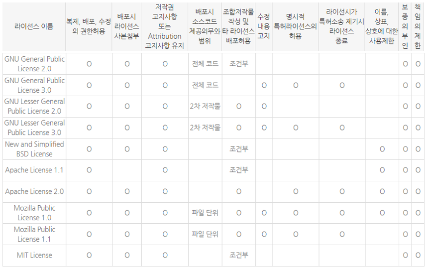
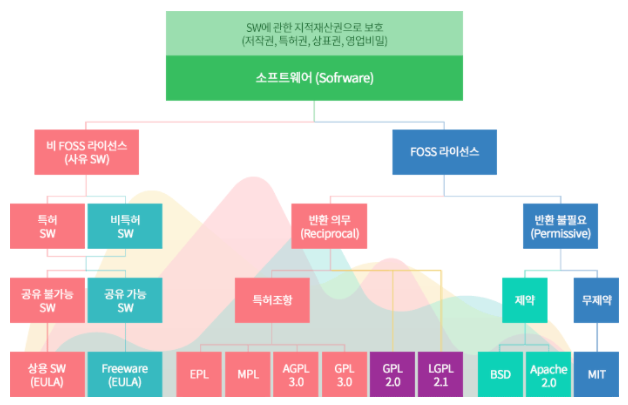

# Open Source Software(OSS)와 제약 종류(Licenses)

 **OSS(Open Source Software), 오픈소스 소프트웨어**란, 소스코드가 공개되어 있는 소프트웨어를 말한다. 일반적으로 자유롭게 사용, 복제, 배포, 수정할 수 있도록 공개되어 있다.

대표적인 예로는 Linux 커널, Apache 웹서버, FireFox 웹 브라우저, MySQL 등이 있다.

 

 **OSS License**는, 소프트웨어 시장이 커짐에 따라 지적재산권 및 라이센스 계약을 통해 소프트웨어의 사용, 복제, 배포, 수정을 제한하려는 움직이 나타나면서 생긴 제약이다. 

 

#### 대표적인 오픈소스 라이센스

* **GPL** : GNU General Public License 2.0
* **LGPL** : GNU Lesser GPL 2.1
* **BSD** : Berkeley Software Distribution
* **Apache**
* **MPL** : Mozilla Public License
* **MIT**

 

------

#### 1. GPL : GUN General Public License 2.0

GPL은 현재 가장 많은 OSS가 채택하고 있는 라이센스이다. 오픈소스 라이센서들 중에서 가장 많이 알려져 있고 의무사항들도 다른 라이센스에 비해 엄격한 편이다.

* 소프트웨어를 배포하는 경우 저작권 표시, 보증책임이 없다는 표시 및 GPL에 의해 배포된다는 사실을 명시
* 소프트웨어를 수정하거나 새로운 소프트웨어를 병합(Dynamic linking 포함)시키는 경우, GPL에 의해 소스코드 제공
* GPL 소프트웨어를 배포하는 경우, 소스 코드 그 자체를 함께 배포하거나 소스코드를 제공받을 수 있는 방법에 대한 정보를 함께 제공

 

#### LGPL: GNu Lesser GPL 2.1

GPL 라이센스를 사용하기만 해도 전체 소스코드를 공개해야 한다는 부담 때문에 라이브러리와 모듈로의 링크를 허용한 라이센스이다.

원래는 한정된 라이브러리에만 적용하려는 의도로 "Library GPL"이라는 이름을 붙였었으나, 모든 라이브러리에 적용된다는 오해를 사서 2.1버전으로 "Lesser GPL"로 변경되었다. 

* 소프트웨어를 배포하는 경우, 저작권 표시, 보증책임이 없다는 표시 및 LGPL에 의해 배포된다는 사실 명시
* LGPL Library의 일부를 수정하는 경우 수정한 Library를 LGPL에 의해 소스코드 공개 (전체가 아닌 수정한 Library)

 

#### BSD: Berkeley Software Distribution License

BSD 라이센스는 GPL/LGPL보다 덜 제한적이기 때문에 허용 범위가 더 넓다.

가장 큰 차이점은 소스코드를 공개하지 않아도 된다는 점이다.

* 소프트웨어를 배포하는 경우 저작권 표시, 보증 책임이 없다는 표시
* 수정 프로그램에 대한 소스 코드의 공개를 요구하지 않기 때문에 상용 소프트웨어에 무제한 사용 가능

 

#### Apache License

Apache 소프트웨어 재단에서 자체적으로 만든 소프트웨어에 대한 라이센스 규정이다.

Apache 재단(ASF: Apache Software Foundation)의 모든 소프트웨어에 적용되며 BSD 라이센스와 비슷하여 소스코드 공개 등의 의무가 발생하지 않는다.

다만 "Apache"라는 이름에 대한 상표권을 침해하지 않아야 한다는 조항이 명시적으로 들어가 있고, 특허권에 관한 내용이 포함되어 BSD 라이센스보다는 좀 더 법적으로 완강된 내용을 담고 있다.

특히 GPL 2.0으로 배포되는 코드와 결합되는 것이 어렵다는 문제가 있는데, GPL 3.0에서는 이 문제를 해결하여 아파치 라이센스로 배포되는 코드가 GPL 3.0으로 배포되는 코드와 결합하여 사용하는 것이 가능해졌다.

 

#### MIT License

MIT 라이센스는 미국 매사추세츠공과대학교(MIT)에서 해당 대학 소프트웨어 공학도들을 돕기 위해 개발한 라이센스이다. 라이센스와 저작권 관련 명시만 지켜주면 되는 라이센스이다. 

* 이 소프트웨어를 누구라도 무상으로 제한 없이 취급해도 좋다.
* 저자 또는 저작권자는 소프트웨어에 관해서 아무런 책임을 지지 않는다.

 

 

> #### References
>
> [1] https://deepinsight.tistory.com/82
>
> [2] https://www.olis.or.kr/license/compareGuide.do

