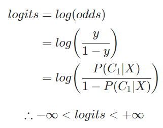
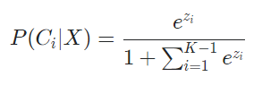

# logit, sigmoid, softmax의 관계

**Logit**은 log odds를 뜻한다. ('logistic'+'prohibit'의 합성어로, odds의 의미, 즉 확률의 의미를 가져온다.)

 **odds**란 도박에서 얻을(pay off) 확률과 잃을 확률(stake)의 비율, 즉 두 확률의 비를 뜻한다.

다음과 같은 조건의 Binary Classification이라고 하면(X가 어떤 클래스인지 맞추는 문제),

* Classes : C1, C2
* Probability of C1 given X : y = P(C1|X)
* Probability of C2 given X : 1-y = P(C2|X)

C1과 C2의 Probability, 즉 P(C1|X)=y와 P(C2|X)=1-y 중에서 큰 값을 X의 클래스로 예측하면 된다.

이 때 **odds**(확률의 비)를 사용해서, 두 가지의 수식을 하나로 합치고 위와 같은 결정 문제(Binary Classification)를 표현할 수 있다.

Neural Network의 출력층의 값을 z라고 하면 z값의 범위는, 

그리고 Neural Network에서 주로 사용되는 손실 함수는 Cross Entropy인데, 이 Cross Entropy를 계산할 때 **확률값**이 사용되기 때문에, z를 확률의 개념으로 변환해야 한다. 

즉, (-∞, ∞)의 범위를 (0, 1)의 범위로 변환해야 한다. 그리고 이 작업은 **sigmoid** 함수를 통해서 변환할 수 있으며, sigmoid 함수는 logit 함수에서 변형하여 도출할 수 있다.

logits과 z의 범위가 같으니 z=logits(동치)로 두고 식을 전개하면,

위의 식을 통해, **sigmoid**와 **sigmoid**는 역함수 관계이며, 2가지 사실을 도출할 수 있다.

* `logits`은 (0, 1)의 범위를 (-∞, ∞)로 변환한다.
* `sigmoid`는 (-∞, ∞)의 범위를 (0, 1)로 변환한다.

 

**Softmax**는 sigmoid 함수를 class가 3개 이상일 때로 일반화하면 유도할 수 있다. 따라서 sigmoid를 일반화하면 softmax이며, softmax의 특수한 경우가 sigmoid함수이다. 

Binary Classification일 때, **odds**는 다음과 같이 정의된다.

틀래스의 개수가 K일 때로 일반화하면 위 식은 아래의 형태로 새로 정의할 수 있다.

양변을 i=1부터 K-1까지 더하면

좌항의 분모는 합연산과 관련이 없기 때문에 바로 표현해줄 수 있다.

확률의 합이 1임을 이용하면, 

따라서 P(Ck|X)에 대해서 정리하면

양변을 i=1부터 K-1까지 더하기 전의 수식을 아래와 같이 표현하면, 위의 수식을 아래에 대입할 수 있게 된다.

대입연산을 해주면,

다시 K-1이전의 식에서 i대신 k를 대입하면 e^zk=1이므로, 최종적으로 softmax 함수를 도출할 수 있게 된다.

 

> #### References
>
> [1] https://velog.io/@gwkoo/logit-sigmoid-softmax%EC%9D%98-%EA%B4%80%EA%B3%84

